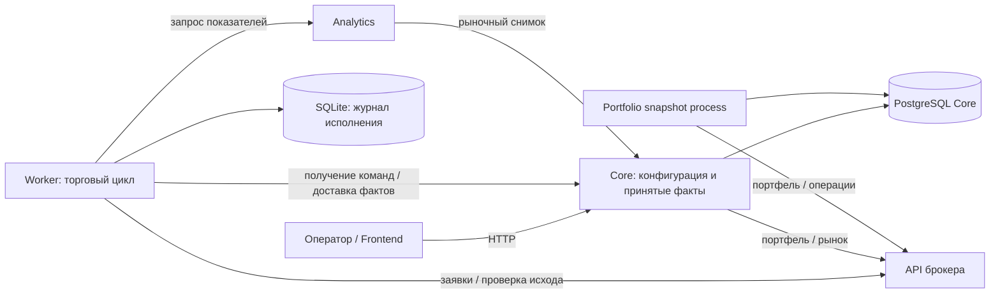

# Оркестрация и восстановимость состояния Worker

Анализ 02.10.2026 по текущему коду P1/P2 и официальным контрактам T-Invest.
Это анализ архитектуры, а не проверка работающего брокерского счёта.
Тесты потери пользовательской БД и реальные торговые RPC не выполнялись.

## Запрос и вывод

Пользователь требует одну PostgreSQL и одну базу данных для сервисов, без
отдельной PROD базы. Перед выбором миграции нужно выяснить, управляет ли Core
всем процессом, и можно ли заменить хранилище Worker чтением брокерского API.

**Торговый цикл оркестрирует Worker. Core управляет конфигурацией и операторским
жизненным циклом, хранит уже принятые торговые факты и их проекции.**
Единственного компонента, который сейчас атомарно фиксирует весь процесс
Core→Worker→брокер, нет. Между Worker и Core существует доставка с подтверждением.

**Брокерского API достаточно для повторного получения текущего счёта, но
недостаточно для точного восстановления всего исполнения приложения.**
Worker SQLite содержит устойчивый журнал исполнения, а не только кэш.
Убрать файл внутри Worker можно, перенеся обязательное состояние в общую
PostgreSQL. Удаление этого состояния и повторное чтение портфеля не равно
такому переносу.

## 1. Фактические роли и связи

| Компонент | Ответственность сейчас | Хранилище и связи |
| --- | --- | --- |
| Frontend | Авторизация оператора, настройки, представление данных, команды жизненного цикла | HTTP Core; брокерский токен не является клиентским источником торговли |
| Core backend | Подключения/счета/каталог, операторские команды, рынок, проверка и применение фактов Worker, проекции для интерфейса | PostgreSQL, HTTP API для Worker/Analytics, API брокера для чтения |
| Worker | Расписание торговых итераций, стратегия, ограничения, фиксация intent, отправка заявки, выяснение результата, локальный ledger, доставка фактов | SQLite, HTTP Core и Analytics, собственный брокерский SDK |
| Analytics | Расчёт показателей над рыночным снимком одного поколения | Без durable БД и брокерских credentials; получает рынок через Core |
| Portfolio snapshot process | Периодический сбор портфеля и сохранённой сводки | Процесс в границе Core; читает брокера и пишет PostgreSQL |
| API брокера | Фактические средства, позиции, заявки и доступные сведения об исполнениях | Внешний источник; внутреннюю стратегию приложения не хранит |

У Core есть адаптер выставления заявок, но в изученном торговом пути
`BatchTradingRuntimeService` отправку выполняет Worker. Само наличие адаптера
в Core не означает, что Core коммитит каждый intent до брокерского RPC.

Кодовые точки: `src/trading_automaton/runtime/streaming_coordinator.py`,
`usecases/synchronize_runtime.py`, `usecases/broker_iteration.py`,
`services/decision_materialization.py`, `services/batch_runtime.py:86`,
`services/order_dispatch.py:50`. Пути после первого здесь относительны
`src/trading_automaton/`.

## 2. Где возникает состояние, которого ещё нет в Core

Последовательность отправки:

1. Worker рассчитывает решение и в одной локальной транзакции сохраняет
   decision, intent `DISPATCH_PENDING`, состояние стратегии и typed outbox.
2. До вызова брокера сохраняет `SUBMITTING` и стабильный ключ идемпотентности.
3. Вызывает SDK и сохраняет известный результат либо `UNCERTAIN`.
4. При финализации связывает исполнение, лоты/распределения, цикл и факты
   в одной локальной транзакции.
5. Отправляет исходные envelopes в Core. Core проверяет UUID, sequence,
   revision и сохраняет принятые факты/проекции в своей транзакции.
6. После ACK Worker удаляет соответствующий outbox. Потеря ACK вызывает
   повторную доставку тех же envelopes, а не создание новых исполнений.

Источники: `storage/repository.py:1692`, `services/batch_runtime.py:99`,
`services/order_dispatch.py:65`, `storage/repository.py:298`,
`services/fact_synchronization.py:104`, `storage/repository.py:1410`;
Core — `src/moex_sentinel/services/trading_fact_ingress.py:92`.

Следовательно, Core содержит принятый префикс исполнения, а Worker может
содержать следующий ещё не принятый участок. Две транзакции не объединяются
от того, что процессы находятся на одном VPS.

## 3. Что можно получить у брокера

| Данные | Доступность через API | Что это позволяет |
| --- | --- | --- |
| Баланс, количество, блокировки, средняя цена позиции | GetPortfolio / GetPositions | Повторно получить текущий счёт и сверить количество/доступность |
| Заявки и их статус, исполненные количества, комиссии | GetOrders / GetOrderState, с ограничениями истории | Выяснить исход известной заявки и сопоставить исполнение |
| История операций | GetOperationsByCursor, с ограничениями идентификаторов и полноты | Дополнительная финансовая сверка, но не точный replay внутреннего процесса |
| Automation/cycle/lot UUID, наша LIFO-привязка | Отсутствуют в изученном контракте | Должны сохраняться приложением |
| Решение WAIT, причина BUY/SELL, исходные параметры стратегии | Отсутствуют в изученном контракте | Должны сохраняться приложением, если требуется история решений |
| Pending outbox, event UUID/sequence/revision/ACK | Отсутствуют в изученном контракте | Требуется собственный журнал доставки |
| pending_low, sell_armed, последняя свеча покупки | Отсутствуют в изученном контракте | Требуется собственное состояние стратегии |

Первые три строки подтверждены [Operations methods](https://developer.tbank.ru/invest/services/operations/methods),
[GetOrders](https://developer.tbank.ru/invest/api/orders-service-get-orders),
[GetOrderState](https://developer.tbank.ru/invest/api/orders-service-get-order-state)
и [GetOperationsByCursor](https://developer.tbank.ru/invest/api/operations-service-get-operations-by-cursor).
Отсутствие внутренних полей — вывод из сопоставления этих контрактов с моделями приложения.

Средняя цена и общее количество не определяют индивидуальные лоты. Например,
две покупки по 100 и 200 и две покупки по 120 и 180 дают одинаковые два лота
со средней ценой 150, но разную себестоимость при продаже последнего лота.
История сделок может помочь, однако дополнительно необходимы наша привязка
к автомату, начальный bootstrap, распределение комиссий и принятая модель LIFO.

Официальное описание предупреждает: GetOrderState может не вернуть сведения
о заявках старше дня; это не метод глубокой истории.
[Описание Orders](https://developer.tbank.ru/invest/services/orders/head-orders).
ID операций могут изменяться, trade IDs разных сервисов могут различаться,
а после корпоративных действий история может быть неполной.
[Особенности Operations](https://developer.tbank.ru/invest/services/operations/operations_problems).

### Конкретный пробел существующего lookup

Текущий `find_by_idempotency_key` ищет совпадение только в GetOrders
(`src/trading_automaton/adapters/tinvest_broker_session.py:267`).
Уже завершённая заявка может отсутствовать в этой выборке. Код сохраняет
неопределённость; отсутствие совпадения не трактуется как доказательство
неотправленной заявки.

Современный GetOrderState поддерживает `ORDER_ID_TYPE_REQUEST` — запрос по
клиентскому ключу. Это кандидат на улучшение recovery известного intent,
с проверкой установленного SDK и пределов API. Даже этот метод не восстановит
утраченный ключ, связь со стратегией и исходные envelopes.
[Контракт GetOrderState](https://developer.tbank.ru/invest/api/orders-service-get-order-state).
Код в рамках этого анализа не менялся.

## 4. Классификация всех Worker таблиц

| Таблица | Роль | Можно ли просто удалить и перечитать брокера |
| --- | --- | --- |
| cached_automations | Проекция команд Core плюс локальные cycle/sequence/revision | Нет: локальное состояние может опережать Core; это не TTL-кэш |
| broker_intents | Ключ идемпотентности, отправка/неопределённость/финализация, связь решения и заявки | Нет: нужно устойчивое состояние до внешнего действия |
| fact_outbox | Точные ещё не подтверждённые Core envelopes и состояние доставки | Нет |
| trade_lots / lot_allocations | Наш ledger, идентичность лотов, LIFO и PnL | Нет; принятый участок теоретически восстановим из Core через новый importer |
| trading_cycle_states | Память стратегии: минимум, повторная активация продажи, последняя свеча покупки | Нет |
| trade_decisions / business_audit_events | История решений/диагностики, включая ещё не доставленную | Нет; после ACK часть дублируется в Core и может стать кандидатом на retention |
| worker_runs | Признак корректного завершения для startup safety | Не брокерские данные; при новом размещении нужен эквивалентный recovery gate |
| account_commission_profiles | Обновляемые тарифные оценки с valid_until | Да, обновляемый кэш; при недоступном источнике торговля должна дождаться допустимых данных |

Все десять ORM-таблиц: `src/trading_automaton/storage/models.py:45`.
Есть также отдельный maintenance `execution_price_repair_journal` в обеих БД.
Его завершённые коррекции необходимо применять после replay исходных фактов;
простое чтение старых envelopes может вернуть исправленную ранее ошибку.
Процедура: `develop/execution-price-repair.md`.

Настоящие временные данные уже существуют в памяти: рынок/свечи Core,
metrics и hydrated position Worker. Analytics выдаёт снимок с TTL≤2000 мс.
Cash reservations в памяти восстанавливаются из durable intents; одного
баланса брокера для их точного восстановления недостаточно.

## 5. Реализовано ли полное восстановление потерянной SQLite

**Нет.** Реализован перезапуск с сохранённой SQLite, обновление команд/statuses
и первоначальное принятие позиции. CoreClient не импортирует полный журнал
лотов, intents, allocations и состояния стратегии.

Более того, Core claim выбирает IN_QUEUE, первоначальный bootstrap HOLD и
resume_requested. Обычный IN_WORK после потери Worker БД не обязательно
попадёт в новый runtime. `src/moex_sentinel/storage/repositories/automation_commands.py:24`.

При пустом ledger и ненулевой брокерской позиции reconciliation может создать
новый RECONCILED lot со средней ценой, нулевой комиссией и временем текущего
наблюдения. Это приближённое принятие количества, не восстановление прежнего
ledger. `src/trading_automaton/services/lot_ledger.py:94`.

Особенно важны четыре сценария:

- Ответ на заявку потерян: брокер мог принять её, а Core ещё не получил intent.
  Утрата стабильного ключа делает повторную новую отправку неоднозначной.
- Исполнение сохранено локально, Core недоступен: snapshot брокера не вернёт
  точные event IDs, allocations и недоставленные факты.
- Core сохранил факт, ACK потерян: нужен replay прежнего event, а не новое событие.
- Всё доставлено, Worker БД потеряна: финансовые проекции есть в Core, но
  полного restore-протокола и доказанного replay состояния стратегии нет.

## 6. Минимальная целевая архитектура

Ниже рекомендация для выбора модели владения данными. Перенос Worker пока
не выбран и не реализован; до реализации необходимо зафиксировать его новые
контракты и обновить текущую границу Core-only PostgreSQL в AGENT_BRIEF.
Само требование одной PostgreSQL/одной database уже задано владельцем.

Рекомендация для выполнения этого требования:

1. **Одна PostgreSQL, одна database для TEST/PROD и владельцев данных.**
   Контуры разделяются immutable scope и проверками каждого пути доступа.
2. **Worker сохраняет журнал исполнения в собственных таблицах той же БД.**
   Процесс становится независимым от локального persistent volume, однако
   обязательное durable состояние сохраняется. Нужен собственный префикс
   таблиц: имя trade_decisions уже пересекается с Core; общий maintenance
   journal также потребует разделения владельцев. У Core лоты называются
   position_lots, у Worker — trade_lots.
3. **Core сохраняет владение конфигурацией и подтверждёнными проекциями.**
   Сервисы не пишут в чужие таблицы. Отдельные роли БД ограничивают права
   каждого владельца; подключение через пул, а не обязательный один socket.
4. **Redis применяется к воспроизводимым снимкам при доказанной потребности
   в общем кэше.** Ключи разделяют environment/broker/account; TTL не заменяет
   проверку исходного captured_at и поколения снимка.
5. **RabbitMQ — возможная отдельная замена доставки команд/фактов.**
   Он не является запросным кэшем. Persistent messages, confirms и ACK
   потребуют идемпотентных обработчиков и сохранения транзакционной связи
   изменения состояния с публикацией. Сообщения могут доставляться повторно.
   [RabbitMQ reliability](https://www.rabbitmq.com/docs/reliability).

Так сохраняется Worker как оркестратор исполнения и устраняется локальная
SQLite без переписывания всей торговой ответственности. Прямой HTTP между
Core/Worker может быть заменён позднее, но связь через версионированные
контракты остаётся. Redis с общими произвольными структурами сам по себе
не уменьшает связность; сервисы могут начать зависеть от формата чужих данных.

Если требуется именно stateless executor без собственного durable журнала,
альтернативой является передача admission каждого intent, execution journal
и состояния стратегии Core до внешнего RPC. Это уже изменение оркестрации
и доступности: отказ Core/БД должен запрещать новую отправку, неизвестный
исход всё равно требует сохранённого ключа и последующей сверки. В текущем
контракте такая архитектура не реализована.

**MySQL в проверенной реализации/Compose отсутствует.** Сейчас постоянные
хранилища — PostgreSQL Core и SQLite Worker; отдельной миграции из MySQL
по найденному коду не требуется.

## 7. Порядок дальнейших работ и критерии

- Сначала завершить разделение TEST/PROD в общей Core БД: mutations,
  command/status queries, fact ingress, summary, единый collector либо
  корректная модель раздельных runs. Старый Sandbox backend обновить до
  первой PROD записи. Первоначальная отдельная PROD БД уже остановлена;
  её volumes сохранены.
- Если выбран перенос Worker: зафиксировать ownership/таблицы и повторить
  на отдельной PostgreSQL атомарность decision+intent+cycle+outbox,
  execution+allocations+outbox, CAS, запрет второго активного intent,
  UTC/Decimal-инварианты. Смена URL не заменяет проверку семантики SQLite.
- До live upgrade: согласованный backup PG+SQLite, restore на отдельном
  экземпляре, сверка ключей/sequence/ledger/repair journal; без удаления
  текущих volumes и без повторного broker side effect.
- Проверить crash до/после dispatch, timeout, partial fill, Core outage,
  потерю ACK, restart без дублей и отказ общей БД. Наблюдаемость должна
  показывать pending intents/outbox, последнюю сверку и свежесть снимков.
- Redis/RabbitMQ вводить отдельным пакетом с измерением нагрузки и gate
  памяти VPS. Установки этих компонентов пока не выполнены.

Dedup успешной одинаковой сверки — отдельное уже реализованное изменение:
сверка остаётся на каждом проходе, новый audit создаётся при первом результате,
изменении, ошибке/восстановлении и restart. Это снижает поток аудита, но не
заменяет архитектурную миграцию и не удаляет исторические записи.

## Кросс-ревью и доказательства

Первичный кодовый аудит: `/root/prod_ui_auth_impl` (gpt-6.1-sol);
карта API, итоговый анализ и интеграция: root.
Кросс-ревью итогового документа: `/root/prod_ui_auth_impl` — PASS;
независимая проверка анализа, связанных документов и интеграции
`/root/prod_integration_review_retry` — PASS после исправления двух Minor.
Существенных открытых замечаний нет. Report:
`develop/reports/architecture-storage-20261002/independent-review.md`.

Подробный source trace: `develop/reports/architecture-storage-20261002/worker-core-audit.md`.
Dedup: автор `/root/prod_worker_impl`, независимый
`/root/prod_integration_review_retry` — PASS, 81 проверка; root — 44 проверки,
6 файлов интегрированы с SHA256 и неизменным Git index, deploy ещё не выполнен.
Runtime facts и прогноз хранения требуют отдельных свежих замеров.
