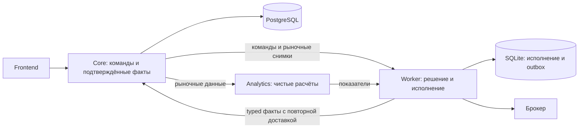

# Архитектура, схема данных и оптимизации

## Вывод

Основные границы приложения соответствуют практическому DDD: Core владеет
подтверждёнными фактами и командами, Worker — исполнением и восстановлением,
Analytics — расчётом рыночных показателей. Проблемы обнаружены прежде всего
на переходах между этими границами и в стоимости чтения растущей истории.
Переписывание приложения на новый набор классов и интерфейсов не требуется.

Изменения подготовлены в исходниках. Рабочие базы и торговые данные не менялись,
новая версия приложения не разворачивалась. Итоговая общая проверка пройдена: 1271 backend-тест и 96 frontend-тестов,
проверка типов, сборка и линтеры успешны.

## DDD и SOLID

**Сильные стороны.** Группа фактов одного автомата принимается атомарно; Worker
сохраняет исполнение, лоты и outbox одной транзакцией. Эти границы согласованности
важнее размера файлов repository. Доменные расчёты вынесены из транспорта,
Analytics не получает credentials, а UI не принимает торговые решения.
Такой подход согласуется с понятием агрегата как границы согласованности,
а не набора ORM-таблиц. [DDD Aggregate, Martin Fowler](https://martinfowler.com/bliki/DDD_Aggregate.html).

**Исправленный дефект границы идентичности.** Операции позиции передавали брокеру
внутренний catalog ID. Теперь position-specific сервис разрешает его в scoped
каталоге и передаёт внешний UID. Generic API брокера сохраняет свой контракт.
Отсутствующий или чужой инструмент не превращается в запрос с неверным ID.

**Оставшиеся архитектурные риски.** Hydration читает durable state несколькими
Session; возможное смешение снимков требует отдельного воспроизведения с
конкурентной финализацией. Техническая причина неожиданного ingress-сбоя плохо
наблюдаема. Некоторые usecases зависят от класса ошибки адаптера. Это кандидаты
на адресные улучшения, а не основание создавать универсальную шину или обёртку
вокруг каждой функции. Подробные места, важность и сценарии:
[DDD/SOLID-аудит](application-ddd-solid.md).

## Таблицы и поля: что действительно избыточно

Инвентаризированы **27 ORM-таблиц и 382 колонки**: Core — 17/248, Worker — 10/134.
Сняты типы, nullable, ключи, ограничения, индексы и ссылки из исходников.
Отдельный журнал ранее выполненной коррекции цен не входит в ORM metadata;
его наличие и требования сохранения отражены в карте владения данными.

Безопасное удаление действующих колонок не доказано. Важные различия:

| Повторяющиеся данные | Почему это не простой дубль |
|---|---|
| Envelope JSON и нормализованные факты Core | Исходный контракт нужен для точного replay; проекции — для запросов |
| Outbox Worker и события Core | Разные стадии доставки и владельцы; ACK удаляет доставленные строки Worker |
| Текущее состояние заявки и история событий | Проекция состояния и последовательность переходов выполняют разные задачи |
| Audit payload и process/stage/ID колонки | Разнородная диагностика и индексируемая корреляция |
| Время события, исполнения, получения и оценки | Разные моменты; их объединение разрушает временной смысл данных |
| Internal instrument ID и внешний UID | Разные пространства идентичности; смешение уже привело к дефекту |

Две Core-таблицы — `broker_account_fee_profiles` и `position_valuation_snapshots` —
не используются текущими runtime-путями. Их статус уточнён в
[карте владения](../data-ownership.md). Они сохранены: отсутствие текущих callers
не доказывает отсутствие нужной истории. Удаление или архивирование требует
отдельного решения по данным и поддержке этой возможности.

Полный разбор, включая назначения полей и реальные writers/readers:
[аудит БД](database-architecture.md),
машинный инвентарь — `../../develop/reports/architecture-performance/schema-inventory.json` (необязательный локальный архив).

## Измеренные и выполненные оптимизации

| Участок и синтетическая нагрузка | До | После | Что изменено |
|---|---:|---:|---|
| Выбор 100 фактов из outbox 100 000 записей | 7 892 мс; 100 000 ORM-объектов | 201 мс; 100 ORM-объектов | SQL отбирает допустимый префикс каждого автомата и ограничивает загрузку |
| Переоценка 10 000 лотов и 10 000 allocations | 453 мс | 145 мс | В decision-пути читаются нужные колонки без создания ORM-объектов |
| Поиск решения по intent среди 100 000 решений | 8,60 мс, SCAN | 0,060 мс, SEARCH | Неуникальный индекс `intent_id` |
| Тикеры для 200 операций, 4 уникальных ID | 200 SQL-чтений на запрос | 4 SQL-чтения на запрос | Повторное использование результата только в пределах запроса, включая отсутствие инструмента |

Это измерения отдельных участков на локальных синтетических данных, не ускорение
всей торговли и не SLA удалённого сервера. Время — медианы; исходные выборки,
число повторов, размер данных и ограничения сохранены рядом со скриптами в
каталоге измерений — `../../develop/reports/architecture-performance/` (необязательный локальный архив).
Для повторов важны одинаковые данные и прогрев: параллельная нагрузка машины
может менять абсолютные значения.

**Outbox.** Bootstrap-группы сохраняют прежний алгоритм: четыре факта нельзя
разрывать лимитом. Обычная очередь использует SQL LIMIT, но будущий retry
блокирует все последующие факты своего автомата. Проверка bootstrap и выборка
читают один физический снимок SQLite; одного логического Session недостаточно
для такого контракта. Поведение драйвера SELECT/BEGIN описано в
[документации SQLAlchemy](https://docs.sqlalchemy.org/en/20/dialects/sqlite.html).
Агрегатный COUNT не нужен: если LIMIT вернул меньше строк, это весь допустимый
набор, и условие deadline можно проверить по нему. Начальная bootstrap-очередь
по-прежнему может потребовать полного чтения — это явное ограничение оптимизации.

**LIFO.** Оптимизирован только decision-путь со свежей Session и неизменяемым
ledger. Финализация исполнения сохраняет прежнее ORM-чтение: эксперимент
показал, что identity map может удерживать Decimal точнее, чем повторное чтение
Numeric(28,9). Общая замена меняла бы финансовый результат. Python Decimal sums
и комиссии закрытых лотов сохранены; история всё ещё читается за O(N).

**Индекс.** Инициализация Worker добавляет индекс и в существующую SQLite,
идемпотентно и без пересоздания таблиц. Проверены сохранность строк, повторный
запуск, новая база и EXPLAIN. На большой базе создание индекса может задержать
старт и удерживать write lock; оно выполняется до запуска торговых задач.
Несоответствующее определение уже существующего индекса с тем же именем
автоматически не исправляется.

**Каталог операций.** Кеш ограничен одним запросом и брокером. Следующий запрос
заново читает каталог; изменения тикера и появление ранее неизвестного инструмента
видны без отдельного механизма invalidation. Денежные поля, сортировка и лимит
ответа не изменены.

## Следующие измерения

1. Core `portfolio_snapshots.run_id`: проверить план PostgreSQL на длинной истории
   перед добавлением индекса. FK сам по себе не создаёт индекс на ссылающейся
   колонке. [PostgreSQL: constraints](https://www.postgresql.org/docs/current/ddl-constraints.html).
2. Воспроизвести конкурентную финализацию между чтениями hydration и оценить
   пользу одного согласованного durable snapshot.
3. Повторить нагрузку на целевом сервере с постоянным диском: fsync, p95/p99,
   общий бюджет соединений и объём очереди. Локальная PostgreSQL для тестов
   работает на tmpfs и не характеризует производительность SSD сервера.
4. Согласовать retention диагностического аудита отдельно от accepted envelopes,
   replay и журнала коррекции. Автоматическое удаление истории не добавлялось.

## Проверка и авторы

Схема и production-оптимизация LIFO: audit_review; DDD/SOLID, operations и индекс: fix_delivery;
тесты и LIFO-измерения: fix_valuation; outbox и интеграция: root.
Production и тесты проверялись независимыми авторами. Значимое замечание к
снимку outbox исправлено и повторно проверено. Свежий полный backend-прогон на отдельной PostgreSQL: **1271 passed, 17 warnings,
297,43 с**, без skips. Frontend: **96 passed**, vue-tsc и Vite build успешны.
Ruff/Black для 34 изменённых Python-файлов и git diff --check проходят.
Warnings относятся к существующим SDK FIGI и Starlette/httpx deprecations.

Перед успешным прогоном исправлен посторонний символ в текущем portfolio.py,
из-за которого первая попытка остановилась на collection. Правильная строка
сверена с ранее проверенным снимком; первая ошибка сохранена в отдельном логе.
Manifest подтверждает отсутствие изменений source/tests/frontend во время
успешного прогона. Артефакты: backend-final.txt, frontend-final.txt,
verification-manifest-check.json и integration-review.md в каталоге измерений.

Независимое итоговое интеграционное ревью пройдено без открытых существенных замечаний. Временная тестовая PostgreSQL остановлена после проверок; рабочие базы и persistent volumes сохранены.
