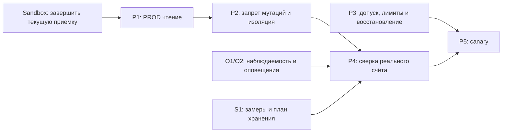

# План разработки и перехода на PROD API

> **For agentic workers:** REQUIRED SUB-SKILL: Use superpowers:subagent-driven-development (recommended) or superpowers:executing-plans to implement this plan task-by-task. Steps use checkbox (`- [ ]`) syntax for tracking.

**Goal:** Добавить реальный T-Invest счёт сначала для чтения, затем для
ограниченной торговли с проверяемым допуском и сохранённым Sandbox.

**Architecture:** одна PostgreSQL/одна database для TEST и PROD Core.
Worker пока владеет SQLite/intent/outbox; необходимость и перенос этого журнала
разобраны в [аудите](../../audits/2026-10-02-orchestration-and-worker-storage.md).
Analytics получает только рынок. У PROD свои scope, application сеть, env и
операторская сессия; отдельной PROD PostgreSQL нет. Реализация объединения
и решение о переносе Worker ещё открыты.

**Tech Stack:** Существующие Python/FastAPI/SQLAlchemy/PostgreSQL 16,
SQLite, `t_tech.invest`, Vue и Docker Compose/Nginx. Новые зависимости
добавлять только для конкретной задачи с обоснованием.

**Spec:** [Проект решения](../specs/2026-10-02-production-api-design.md).

Статус на 02.10.2026: код P1/P2 реализован и прошёл независимое ревью.
Изолированные проверки базового кода выполнены; объединение Core БД,
capacity gate новой архитектуры и live приёмка ещё открыты. Первоначальный
отдельный PROD prototype остановлен после уточнения о единой БД.
Пользователь разрешил поэтапную реализацию READ_ONLY. P3/P4/P5 остаются
открытыми; реальные торговые действия требуют отдельного допуска владельца.

## Global Constraints

- Сейчас Core владеет PostgreSQL, Worker — SQLite. Целевая БД одна;
  перенос журнала Worker отдельно не выбран. Владение таблицами сохраняется.
- Analytics не получает credentials или портфель.
- TEST и PROD Core используют одну database/PG volume и изолированные scope,
  env и session stores. Все reads/mutations/internal facts разделяют контуры.
- Worker volumes пока сохраняются; их удаление не является восстановлением
  из API брокера. Перенос постоянного состояния требует отдельной реализации.
- Bootstrap не создаёт брокерскую заявку или исполнение.
- PROD начинает с READ_ONLY; включение стратегии всегда явное.
- Нет обязательного лимита или есть противоречие конфигурации — торговли нет.
- Финансовые факты, event/idempotency IDs и repair journals сохраняются.
- Тесты выполняются на отдельной БД; рабочие volumes не удаляются.
- Реальные торговые действия требуют отдельного допуска владельца.
- Перед каждой вехой независимое кросс-ревью; изменения пользователя не
  стадировать и не коммитить общей командой `git add .`.

## Review Focus

1. Несовпадение TEST/PROD, adapter, target или account ID отклоняется до RPC (P1).
2. READ_ONLY запрещает мутации из retry/recovery, а не только стратегии (P2).
3. Bootstrap с short, дробными лотами, blocked inventory и stop-order не
   создаёт ложную позицию; исключения видны оператору (P1, P4).
4. Второй Worker, потеря ACK и timeout отправки не создают повторную заявку (P3).
5. Rollback, retention и восстановление не теряют новые исполнения,
   последовательности и исправления цены (P3, P5).

## Зависимости и контрольные точки

P3 проверяется синтетически до реальной торговли; отсутствие полного
согласования численных лимитов не блокирует разработку P1/P2 и READ_ONLY.

### B. Завершить текущую приёмку Sandbox

- [x] Сверить broker/Core/Worker по external UID, количеству и средней цене;
  проверить effective strategy=false, intent/order/execution counts и outbox.
- [ ] Проверить одну штатную перезагрузку Worker без дублей cycle/lot/fact,
  отображение списка инструментов/поиска/карточки в браузере и serving image.
  UI/serving image проверены02.10; перезагрузка ещё не выполнялась.
- [ ] Закрыть независимую runtime приёмку. Сохранить фактические timestamps,
  исключения и ограничения. SSH/sudo восстановлены02.10; read-only ledger/ACK
  и storage baseline прошли независимое ревью. Browser logout204/session401
  проверены живым прогоном exit0; restart acceptance остаётся открытой.

### P1. Единый выбор контура и чтение PROD

**Files:** `src/moex_sentinel/adapters/tinvest/api_module.py`,
`adapters/registry.py`, `services/brokers.py`, `services/broker_factory.py`,
`services/automaton_brokers.py`, `adapters/tinvest/{portfolio,market_data,market_stream_source,order_execution}.py`,
`src/trading_automaton/adapters/tinvest_broker_session.py`,
`src/trading_automaton/composition.py`, `src/sentinel_contracts/broker_execution.py`,
`frontend/src/components/BrokerForm.vue`, `frontend/src/views/BrokersView.vue`.
Общий resolver двух разрешённых контуров реализован в
`src/sentinel_contracts/tinvest.py` и используется Core и Worker.

**Interfaces:** Внутренний `BrokerConnection` несёт явные TEST/PROD и режим
READ_ONLY/TRADE; прежние adapter codes обрабатываются совместимо. Код resolver
сопоставляет contour/adapter/FQDN, не принимает произвольный host.
PROD account/portfolio/positions идут через users/operations services,
TEST сохраняет свои Sandbox методы. Market methods используют выбранный target.

- [x] RED/GREEN: параметризовать существующие adapter/registry/worker tests для
  обоих контуров. Проверять вызванный service/method и точный target;
  PROD никогда не вызывает `services.sandbox`, TEST не попадает в PROD.
- [x] RED/GREEN: отвергнуть неправильный target, чужой account, смену scope после
  любого выбора account (включая disabled, до фактов, с row lock); проверить cash/blocked money, lot_size/валюты, short/дробные лоты,
  ошибки токена и неподдерживаемые позиции без потери отчёта.
- [x] Реализовать routing/validation и отображение контура/счёта в UI;
  не передавать секреты в Analytics, метрики или safe error text.
- [ ] GREEN: `tests/adapters/test_tinvest_*`, `tests/adapters/test_broker_api_registry.py`,
  `tests/services/test_broker_service.py`, Worker session/composition tests,
  frontend BrokerForm/Brokers tests; тестовая PostgreSQL при изменении schema.
- [x] Независимое ревью кода: routing, единицы измерения, совместимость Sandbox,
  поведение отказов; `/root/prod_integration_review_retry` — PASS.
  Полная интеграционная приёмка остаётся открытой до общей регрессии с отдельной
  PostgreSQL; fake SDK не заменяет авторизованные live чтения P4.

### P2. READ_ONLY и изолированное развёртывание

**Files:** `src/moex_sentinel/config.py`, `src/trading_automaton/config.py`,
`src/trading_automaton/composition.py`, `src/moex_sentinel/api/{app,auth}.py`,
`src/moex_sentinel/services/automaton_brokers.py`, `compose.yml`,
`deploy/remote/{compose.remote.yml,preflight.py,.env.example}`,
`deploy/remote/nginx-ip.conf`, `.env.example`.

**Interfaces:** обязательный `BROKER_ACCESS_MODE`; server-owned
`AUTH_SESSION_COOKIE_NAME` с безопасным `__Host-` именем для HTTPS,
разными значениями Sandbox/PROD. READ_ONLY блокирует все broker mutations
в adapters/session, включая retry/cancel, даже если стратегия ошибочно вернула BUY.
Bootstrap/internal fact delivery разрешены. Worker сверяет Core contour/mode
до изменяющих HTTP и SDK. Outbox проверяет credential-free BrokerScope,
account/environment и cache, включая CLOSED и disabled broker. Прямые торговые команды API
в READ_ONLY отвергаются сервером; кнопки UI объясняют режим.

- [x] RED: spy/fake SDK доказывает **ноль** post/cancel/replace/stop calls в
  READ_ONLY при стратегии, старом pending intent, restart/recovery и ручном API.
  При наличии старого intent startup прекращает торговый допуск с диагнозом.
- [x] RED: missing/invalid mode, PROD с implicit strategy enable и mismatch
  backend/Worker mode дают config error; любые настройки только для UI не
  могут открыть broker write path. Sandbox продолжает проходить регрессию.
- [x] Изменить разрешающие defaults на безопасные; добавить серверный guard
  у мутаций. READ_ONLY не создаёт новые intent, но может синхронизировать ledger.
- [x] RED/GREEN: login/logout двух приложений с одного IP на разных портах
  не заменяют cookie другой среды; csrf, Secure/HttpOnly/SameSite и отзыв сессии работают.
- [x] RED/GREEN: у каждого backend точный allowed Origin с scheme/host/port
  для login и всех изменяющих auth/API запросов. Запрос Sandbox→PROD и обратно
  с обеими cookies/CSRF от каждой среды отклоняется до изменения; permissive
  CORS отсутствует. Диагностические клиенты задают свой разрешённый Origin явно.
Шаблоны Compose/env/preflight и Nginx подготовлены; следующие пункты относятся
к ещё не выполненной эксплуатационной приёмке:

- [ ] Перед запуском PROD завершить общую Core database: contour guards,
  summary/collector, private data network и обновление старого Sandbox backend.
- [ ] Обновить Compose/preflight без второго database service и PG volume.
- [ ] Создать новый application project/env; проверить ресурсный запас, уникальность
  сетей и имён, loopback UI, внешний HTTPS8443 и закрытые internal/DB/metrics.
  Nginx связывает каждый origin только с его backend; sandbox env не редактируется.
- [ ] Независимая приёмка: auth+Compose+preflight tests и denied broker writes,
  2 UI доступны одновременно. Итог в runbook; backups root-only без токенов в отчётах.

### P3. Допуск торговли и восстановление

**Files:** Worker composition, dispatch/materialization/order-tracking,
`src/sentinel_contracts/broker_execution.py`, Core internal automaton contracts,
Core lease repository/service, schema migration при необходимости,
`deploy/remote/preflight.py`; отдельный `docs/deployment/production-cutover.md`.
Новый Core account lease — узкое средство запрета второго runtime; Worker
не получает прямого доступа к PostgreSQL.

**Interfaces:** TRADE разрешён только при свежем серверном разрешении для
scope, действующей lease, явной стратегии и заданных лимитах. Worker заново
проверяет допуск непосредственно перед отправкой/retry. Lease/arming потеряны —
новые мутации запрещены; UNKNOWN не заменяется свежим intent/idempotency key.
Lease сама по себе не fencing для брокера. Выбран контролируемый takeover:
новый TRADE runtime допускается только после подтверждённой остановки старого
процесса и его авторестарта, сверки unresolved intent и свежей операторской
активации; автоматическое переключение на второй Worker при expiry запрещено.

- [ ] Определить обязательные лимиты: UID allowlist, max order notional,
  exposure, число outstanding orders, дневной убыток с выбранной базой/валютой.
  Пустые значения запрещают TRADE. Пороги владелец задаёт до допуска.
- [ ] RED/GREEN: запрет второго Worker для account scope, истёкшая lease,
  revoke arming во время queued/retry, лимиты покупок **и продаж**, stale рынок,
  пропуск комиссии/blocked funds. Проверить восстановление после restart.
- [ ] RED/GREEN: Worker A остановлен тестом сразу после проверки допуска,
  lease истекает/отзывается, Worker B пытается takeover. B не получает TRADE
  до подтверждённой остановки A и выяснения исходов; новый конфликтующий
  submit не допускается. Проверка lease прямо перед RPC этот тест не заменяет.
- [ ] RED/GREEN: partial fill, потеря ACK, timeout после broker acceptance,
  replay старого события и correction journal не дублируют broker submit,
  исполнения, cycle/lot. Использовать существующие isolated integration fixtures.
- [ ] Проверить kill switch с операторским подтверждением результата:
  прекратить новые post/retry, продолжить безопасное чтение/сверку;
  действующие broker orders учесть отдельно. Core outage также закрывает допуск.
  Lease не отменяет уже летящий RPC: его исход остаётся предметом reconciliation.
- [ ] Проверить paired backup/restore PG+SQLite, sequence/revision, pending
  intents и применение repair journals в **отдельной** среде без реальных writes.
- [ ] Независимое ревью и операционная репетиция; записать команду остановки,
  человека, получающего alert, и процедуру UNKNOWN. Без этих результатов canary закрыт.

### P4. Подключить реальный счёт для чтения

**Consumes:** P1/P2, O1/O2 из плана наблюдаемости, S1 из плана хранения.
**Produces:** подписанный оператором отчёт о счёте и результатах сверки.

- [ ] Владелец выпускает read-only PROD токен и вводит его через защищённый
  интерфейс/сервер. Проверить DNS/TLS/gRPC и авторизованные чтения с VPS;
  не считать один открытый TCP443 доказательством доступности RPC.
- [ ] Выбрать точный активный account; получить портфель, blocked balances,
  активные обычные и stop-orders, каталог и рынок. Не отменять и не менять заявки.
- [ ] Импортировать текущее состояние в чистый PROD scope; Worker выполняет
  bootstrap с запрещёнными broker writes. Проверить ledger по UID и исключения.
  История прибыли начинается с новой baseline, история Sandbox не переносится.
- [ ] Наблюдать полный торговый день и закрытый рынок; UI, свежесть данных,
  доставку facts, нулевые app-created intent/submits/cancels и оповещения проверить отдельно.
  Внешние исполнения допустимы: актуальные reads их показывают; затронутый
  automation переводится в HOLD до принятой сверки, без выдуманных execution
  facts из snapshot. Тест active external order→partial fill закрепляет политику.
- [ ] Сопоставить счёт с кабинетом владельца, принять отчёт cross-review.
  Не объявлять SLA по одному дню наблюдений.

### P5. Canary и расширение

- [ ] Проверить все P3/P4 gates и согласованные численные лимиты; получить
  отдельный допуск владельца на реальную торговлю и конкретный account/UID.
- [ ] Владелец заменяет read-only токен разрешённым trading token для
  выбранного счёта. Проверить новые права безопасными чтениями; не посылать
  пробный ордер для проверки подключения.
- [ ] Перед стартом свежая сверка orders/stop-orders/positions, paired backup,
  здоровый monitoring, единственный Worker, исключённые внешние конфликты.
- [ ] Включить ограниченный canary по одному UID; остальные позиции остаются
  под наблюдением без торговли. Подтвердить intent→broker order→execution→
  Core/Worker ledger и комиссии для реально произошедших действий.
- [ ] При stale/UNCERTAIN/mismatch/потере lease/лимите запретить новые действия,
  проверить исход отправленного RPC у брокера, уведомить оператора.
- [ ] Перед откатом к READ_ONLY дождаться/выяснить исход каждого ордера.
  Не восстанавливать БД до даты уже совершённых сделок и не переносить
  real ledger в Sandbox. Code rollback только при совместимом протоколе/schema.
- [ ] Расширить allowlist/бюджет только после принятого отчёта canary и
  отдельного решения владельца. Зафиксировать ограничения и storage forecast.

## Исполнение и доказательства

Каждую программную веху реализует назначенный саб-агент, другой агент
проверяет контракты/SOLID/ошибки/тесты; root проверяет интеграцию.
Секреты не включаются в документы, Git или диагностические payload.
Отчёты сохраняются в `develop/reports/` с UTC capture window;
`develop/CURRENT.md` содержит следующий шаг, а не архив логов.

Следующий шаг — завершить общую регрессию на отдельной PostgreSQL и
интеграционную приёмку P1/P2. Затем проверить capacity gate и готовность
наблюдаемости/хранения перед отдельным PROD READ_ONLY runtime и live сверкой.
Реальный read-only токен владелец вводит через защищённый UI. Неверный
синтетический токен с AsyncClient SDK1.49.3 дал UNAUTHENTICATED и подтвердил
TLS/gRPC, но не авторизованные RPC; evidence:
`develop/reports/prod-api-20261002/prod-sdk-network.json`.
Текущее развёртывание Sandbox не изменено. PROD торговля закрыта до P3/P4/P5.

## Ревью проектной вехи

Автор design/плана/наблюдаемости — root; inventory `/root/sandbox_probe`.
Независимый `/root/sandbox_final_review`: PASS после исправлений Origin
изоляции, controlled takeover после lease race, внешних partial fills и
fresh-heartbeat/stuck-iteration. Арифметика storage и локальные ссылки проверены,
`git diff --check` прошёл. Это ревью документов, не приёмка PROD runtime.
Свежие SSH, read-only ledger/ACK, browser data и storage baseline проверены02.10;
полная Sandbox runtime приёмка ещё требует restart без дублей.
Browser logout204/session401 подтверждены; S1 суточный/недельный ряд ещё не собран.

## Ревью реализации P1/P2

Авторы Core/Worker/UI: focused проверки 326/601/119 соответственно.
Независимый `/root/prod_integration_review_retry`: code PASS,
150 Python и29 UI проверок. Frontend119, typecheck и build exit0.
Эти результаты не заменяют общий pytest с отдельной PostgreSQL, итоговую
интеграционную приёмку и live P4. Документная актуализация ещё требует
независимого финального ревью; деплой и реальная торговля не выполнены.
