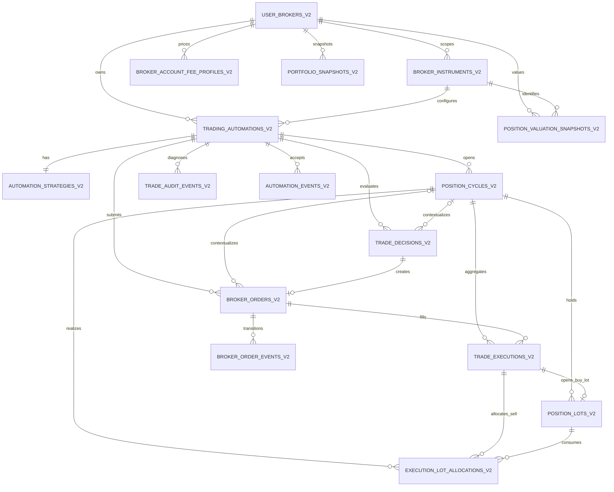

# Trading Data Schema and Legacy Migration Design

## Status

- Date: 2026-08-10
- Milestone: `0.2.1`
- Priority: CRIT
- Decision: normalized authoritative trading facts in Core
- Review state: approved section by section; awaiting review of this consolidated specification
- Constraint: no Git commits

## Goal

Replace the overlapping Core and Worker trading schemas with one normalized Core
fact model, retain only operational recovery state in Worker, and migrate all
existing data without silent loss or invented detail.

The migration must preserve the ability to reconstruct, in deterministic order:

- the user's request to run an automation;
- every strategy decision, including decisions that produced no order;
- every broker order and its lifecycle;
- every known execution and its commission;
- position opening, averaging, partial closing, full closing and reopening;
- every business-audit stage associated with the process.

## Storage-topology amendment

The fact model in this specification was originally scoped to the existing
SQLite runtime. The subsequently approved
`2026-08-10-decoupled-database-runtime-design.md` makes the PostgreSQL transition
a prerequisite for `0.2.1.2`. It changes deployment and storage topology, but not
the normalized fact semantics, ownership rules or migration precedence below.

## Non-goals

- introducing a shared database connection between Core and Worker;
- introducing Redis or an event-store architecture;
- adding more broker API implementations;
- reconstructing broker fill granularity that was never present in legacy data;
- deleting source databases or legacy tables in the same step as data migration.

## Terminology

### User broker

`user_broker` is one configured connection to one external broker account. It is
not a catalog entry for a broker company.

One API connection that exposes two accounts is represented by two user-broker
records. A record may temporarily have no external account while its state is
`DRAFT`; no trading entity may reference a draft record.

### Trading automation

A trading automation is the user's durable intent to let the worker trade one
instrument using one strategy. It is not a broker order. An automation remains
active after its position reaches zero and ends only through the explicit manual
`CLOSED` lifecycle.

### Broker order and execution

A broker order is one actionable order generated by one decision. One broker
order may have zero or many executions because the broker can reject it, leave it
pending, or fill it partially.

### Position cycle

A position cycle starts when inventory changes from zero to positive and closes
when it returns to zero. A still-active automation may create a later cycle.

## API registry and configuration

Available broker APIs are declared in code, not in a database table:

```text
BrokerApiRegistry
api_slug -> adapter factory
         -> Pydantic settings model
         -> capabilities
         -> supported environments and default endpoints
```

The persisted `api_slug` is validated by the service against this registry. If a
module is removed, its rows and history remain stored, but the user broker becomes
unavailable and returns a typed configuration error.

No `brokers`, `broker_providers`, or `broker_accounts` table remains in the target
schema.

## Ownership boundary

### Core

Core is the only permanent source of truth for:

- user-broker configurations;
- the instrument catalog scoped to each user broker;
- automation lifecycle and strategy configuration;
- position cycles;
- decisions;
- broker orders and order-state history;
- executions, lots and sell allocations;
- business audit;
- accepted inter-service fact envelopes;
- fee profiles and analytical snapshots.

### Worker

Worker persists only data needed to survive a process, SDK, network or Core
failure:

- cached commands;
- a local journal for non-terminal broker orders;
- a unified fact outbox;
- cash reservations;
- current durable strategy/cycle recovery state;
- commission cache;
- worker-run and recovery markers.

Worker rows are operational replicas or undelivered facts, never a competing
permanent source for the UI. They can be removed only after the corresponding Core
fact is acknowledged and the broker order no longer requires local recovery.

Core and Worker continue to use isolated database sessions and files. Direct
concurrent access to one SQLite session is forbidden.

## Target Core schema

All primary keys are UUID strings. All scoped business tables contain a mandatory
`user_broker_id`. Critical child relations use scope-consistent foreign keys so a
child cannot point across user brokers.

### `user_brokers`

Stores one configured API/account scope:

- `id`;
- `api_slug`;
- `display_name`;
- `environment`: `TEST` or `PROD`;
- `fqdn`;
- `settings`: JSON validated by the registered adapter settings model;
- `external_account_id`, nullable only in `DRAFT`;
- `state`: `DRAFT`, `ACTIVE`, `DISABLED`, or `ERROR`;
- `created_at`, `updated_at`.

Constraints:

- an `ACTIVE` row requires an external account ID;
- a row with trading history cannot be deleted;
- configured rows are disabled rather than deleted;
- the same non-null account cannot be configured twice for one API and
  environment.

Settings remain unencrypted for the MVP, as previously agreed. They must never be
written to application logs or audit payloads.

Sandbox account creation and funding are actions, not persisted connection
configuration. The UI sends the requested funding amount to the provisioning
usecase, the service validates it and calls the selected API module, and only the
returned `external_account_id` is stored. Current account existence and balance
are read from the broker API. No provisioning-state or initial-balance column is
stored in the target schema.

The broker-connection page owns the funding amount and the current preparation
indicator as transient presentation state. On opening or refreshing the page it
requests the actual sandbox account state from Core; Core obtains that state from
the registered broker adapter. The UI performs no business validation. The
provisioning service validates the submitted amount and returns a typed field
error for the amount control when it is invalid. This UI/use-case cutover is
implemented with the repository cutover in `0.2.1.5`; milestone `0.2.1.1` only
ensures the target schema cannot persist these values.

### `broker_instruments`

Stores the catalog returned by one configured API/account:

- `id`, `user_broker_id`;
- `external_instrument_id` and `external_identifiers` JSON containing only
  non-secret identifiers declared by the adapter contract;
- `ticker`, `name`, `instrument_type`, `class_code`, `currency`;
- `lot_size`, `min_price_increment`;
- `api_trade_available`, `is_active`, `is_selected`;
- `first_seen_at`, `last_seen_at`, `created_at`, `updated_at`.

Unique key: `(user_broker_id, external_instrument_id)`.

An instrument missing from a later broker response becomes inactive. It is not
deleted because historical trading rows reference it. The legacy global
`instruments` table is removed only after successful migration.

### `strategy_templates`

Stores defaults copied into newly created automations. It is not referenced by a
decision after the copy has been made.

### `instrument_strategy_defaults`

Stores optional user-broker/instrument overrides used when a new automation is
created. It replaces the legacy `strategy_configs` table and preserves its
extension settings as validated JSON where no common typed field exists. Once an
automation is created, its own strategy snapshot is independent of later default
changes.

### `trading_automations`

Stores the user's automation intent:

- `id`, `user_broker_id`, `instrument_id`;
- lifecycle state, suspended state and hold reason;
- `revision`, `last_sequence_number`, `resume_requested`;
- `created_at`, `updated_at`, `closed_at`.

There may be only one non-closed automation for one
`(user_broker_id, instrument_id)`.

Inventory and P&L are not independent facts in this table. They are read from the
current position-cycle aggregate, which is rebuilt from executions.

### `automation_strategies`

Stores the current mutable strategy configuration one-to-one with an automation.
It has its own revision and timestamps. Each trade decision also stores an
immutable JSON snapshot of the exact strategy used for that calculation.

### `position_cycles`

Stores a transactionally maintained, rebuildable execution aggregate:

- `id`, `user_broker_id`, `automation_id`, `instrument_id`;
- `state`: `OPEN` or `CLOSED`;
- quantity, average entry price and invested amount;
- realized, unrealized and net P&L;
- accumulated commissions;
- `opened_at`, `closed_at`, `created_at`, `updated_at`.

One automation may have at most one cycle with `closed_at IS NULL`.

### `trade_decisions`

Stores one immutable strategy evaluation:

- `id`, `fact_id`, `process_id`;
- `user_broker_id`, `automation_id`, optional `position_cycle_id`;
- instrument, quantity, lot size and current position values;
- current price, best bid, best ask and calculated indicators;
- estimated commission;
- decision and reason code;
- requested decision quantity and limit price;
- immutable strategy snapshot;
- `decided_at`, `created_at`.

`WAIT` and `NO_ACTION` are persisted. One decision creates at most one broker
order.

### `broker_orders`

Stores one specific order sent or intended for the broker:

- `id`, `fact_id`, `user_broker_id`, `automation_id`;
- `decision_id`, optional `position_cycle_id`, `instrument_id`;
- `idempotency_key`, optional `external_order_id`;
- intent kind, side, type, state, quantity and limit price;
- requested/executed amounts and estimated/executed commission;
- immutable strategy snapshot;
- `created_at`, `dispatch_started_at`, `broker_responded_at`, `executed_at`,
  `terminal_at`, `updated_at`.

Unique keys:

- `(user_broker_id, idempotency_key)`;
- `(user_broker_id, external_order_id)` when the external ID is non-null;
- `decision_id`, enforcing at most one order per decision.

Orders with history are never deleted.

### `broker_order_events`

Stores immutable order lifecycle transitions:

- `id`, `fact_id`, `user_broker_id`, `automation_id`, `broker_order_id`;
- `from_state`, `to_state`, safe reason/message;
- `occurred_at`, `created_at`.

This table is the structured lifecycle history and is distinct from diagnostic
business audit.

### `trade_executions`

Stores the most detailed operation known to the system:

- `id`, `fact_id`, `user_broker_id`, `automation_id`;
- `broker_order_id`, `position_cycle_id`, `instrument_id`;
- optional `external_execution_id`, required for `BROKER_FILL` and nullable only
  for legacy data that never contained a broker execution identifier;
- side, executed lots, price and value;
- broker commission, other fees and currency;
- `source`: `BROKER_FILL` or `LEGACY_AGGREGATE`;
- `is_aggregated`, optional `legacy_source_id`, optional `migrated_at`;
- `executed_at`, `created_at`.

Unique key: `(user_broker_id, external_execution_id)` when the external ID is
available. A new integration must save each broker fill separately when the API
provides that detail.

### `position_lots`

Stores open-inventory attribution created by BUY executions:

- `id`, `user_broker_id`, `automation_id`, `position_cycle_id`;
- `buy_execution_id`;
- original and remaining lots;
- entry price and attributed entry commission;
- `opened_at`, `created_at`, `updated_at`.

One BUY execution creates one source lot unless the broker explicitly provides
smaller independently identifiable fills, which are already separate executions.

### `execution_lot_allocations`

Stores LIFO allocation of SELL executions to source lots:

- `id`, `user_broker_id`, `automation_id`, `position_cycle_id`;
- `sell_execution_id`, `position_lot_id`;
- allocated lots, entry/exit values and attributed commission;
- realized P&L;
- `allocated_at`, `created_at`.

Unique key: `(sell_execution_id, position_lot_id)`. These rows make historical
P&L reproducible without rerunning a potentially changed allocation algorithm.

### `trade_audit_events`

Stores immutable process diagnostics:

- `event_id`, `process_id`, optional `parent_process_id`;
- `user_broker_id`, mandatory `automation_id`;
- optional `decision_id`, `broker_order_id`, `execution_id`;
- instrument, level, stage, safe message and filtered JSON data;
- `occurred_at`, `created_at`, `critical`.

Audit links are optional because a `WAIT`, calculation failure or rejected SDK
call may have no order or execution. Audit never changes lifecycle or financial
state.

### `automation_events`

Stores the accepted Worker-to-Core fact envelope for idempotency and ordering:

- `event_id`, `automation_id`, `user_broker_id`;
- `sequence_number`, `expected_revision`, `fact_kind`;
- safe message and typed payload;
- `occurred_at`, `received_at`.

Unique keys: `event_id` and `(automation_id, sequence_number)`.

### Supporting tables

- `broker_account_fee_profiles`: rates, source, calculation and expiry times per
  user broker, instrument type and currency;
- `portfolio_snapshots`: account-level value, free cash and P&L with
  `captured_at` for analytics;
- `position_valuation_snapshots`: migrated and newly captured historical
  valuations that cannot be represented as executions; this is an analytical
  read model, not an execution fact;
- `instrument_sync_state`: one row per user broker with attempt/success times and
  safe error state;
- `system_events`, `app_settings` and `worker_heartbeats`;
- temporary `data_migration_runs` and `legacy_id_map` used to make migration
  reporting and deterministic reruns explicit.

## Relationships

### Physical shadow schema for `0.2.1.2`

All new trading-fact and analytical tables use the `_v2` suffix while legacy
tables and runtime read paths remain active. The parent tables
`user_brokers_v2` and `broker_instruments_v2` were introduced in `0.2.1.1`.
Removing the suffix or deleting legacy structures is outside `0.2.1.2` and may
only happen after cutover and reconciliation.

The migration, repository and acceptance boundaries are detailed in the
[`0.2.1.2` Core trading facts shadow schema design](./2026-08-12-core-trading-facts-shadow-schema-design.md).



Every scoped relation carries `user_broker_id`. Repositories must reject a
cross-scope relation before persistence, and the critical order/execution links
must also be protected by database constraints.

The database enforces the following critical invariants in the shadow schema:

| Invariant | Constraint |
|---|---|
| Scope cannot cross a user broker boundary | Composite foreign keys include `user_broker_id` and the referenced entity ID |
| One active automation per instrument | Partial unique index on `(user_broker_id, instrument_id)` for non-closed rows |
| One open position cycle per automation | Partial unique index on `(user_broker_id, automation_id)` where `closed_at IS NULL` |
| One order at most per decision | Unique key on `decision_id` within the same scope |
| Repeated order submission is idempotent | Unique key on `(user_broker_id, idempotency_key)` |
| Broker order and execution IDs are not duplicated | Partial unique keys on scoped non-null external IDs |
| A Worker fact is accepted once and in order | Unique keys on `event_id` and `(automation_id, sequence_number)` |
| A SELL execution consumes a source lot once | Unique key on `(sell_execution_id, position_lot_id)` |

The diagram shows ownership and fact lineage. Redundant scope columns on child
rows are intentional: they make tenant filtering explicit and allow composite
foreign keys to reject cross-scope links at the database boundary.

## Fact delivery flow

1. Core validates and stores the user broker against the code registry.
2. Instrument synchronization upserts the user-broker catalog and marks missing
   rows inactive.
3. Core creates an automation and strategy with state `IN_QUEUE`.
4. Worker claims the command and computes an immutable decision.
5. Before calling the SDK, Worker persists the decision, proposed order IDs and
   idempotency key in its local fact outbox.
6. Worker calls the SDK and adds order states and executions to the ordered fact
   stream.
7. Core ingests a typed batch in one transaction per automation:

```text
decision
-> broker order
-> order event
-> execution
-> LIFO lot/allocation
-> position-cycle aggregate
-> automation aggregate
-> linked audit
```

8. Core returns accepted fact IDs and the maximum sequence number.
9. Worker acknowledges the local outbox and removes only records no longer needed
   for broker recovery.

Core ingestion is idempotent. A duplicate fact returns the already accepted
position without applying its financial effect twice.

## Legacy sources and precedence

The migrator reads both existing SQLite databases:

- Core owns old user configuration, instrument catalog, automation lifecycle and
  already accepted projections;
- Worker owns decisions, broker intent lifecycle, LIFO attribution, pending
  recovery state and undelivered audit;
- an existing Core projection verifies a Worker fact but does not override a
  newer Worker terminal fact.

Overlapping rows are reconciled using:

- automation UUID;
- idempotency key;
- external broker order ID;
- external execution ID;
- process and event IDs;
- event sequence and timestamps.

A known older Core projection may be advanced by a newer Worker fact and is
reported as reconciled lag. A conflicting quantity, amount, side, price,
commission or terminal result is an irreconcilable migration error.

## Migration architecture

Migration runs in maintenance mode with stopped Core and Worker.

### Phase 1: preflight and backups

- validate Core and Worker schema versions;
- discover configured API slugs and accounts;
- verify all required source tables and foreign-key relationships;
- detect pending outbox and non-terminal broker recovery;
- produce a no-write dry-run report;
- make file-level backups of both SQLite databases.

Source values must never be printed when they represent connection settings.

### Phase 2: shadow schema

Alembic creates target tables next to old tables. Conflicting names use `_v2`
during migration. A dedicated migration service/CLI reads both databases and
writes Core; cross-database data movement is not hidden inside a single Alembic
revision.

### Phase 3: user brokers and instruments

- convert `brokers` plus `broker_fields` to `user_brokers`;
- map legacy provider/adapter codes through an explicit code mapping;
- validate assembled settings with the current adapter model;
- derive accounts from configured account values, Core automations and Worker
  command cache;
- omit the legacy `initial_balance` and `test_account_funded` configuration fields
  by explicit design decision; the report records only that these deprecated
  field names were excluded, never their values;
- create separate user brokers for multiple accounts;
- migrate an unprovisioned row as `DRAFT` only when it has no trading facts;
- copy or deterministically duplicate the instrument catalog per user broker;
- fold `watchlist_items.enabled` into `broker_instruments.is_selected` and report
  conflicting selection values;
- convert `strategy_configs` into `instrument_strategy_defaults`;
- convert legacy `sync_state` into `instrument_sync_state`;
- re-scope portfolio and position snapshots to the derived user broker.

### Phase 4: automations and facts

- preserve automation UUIDs and current strategy values;
- migrate Worker decisions as immutable Core decisions;
- merge Worker `broker_intents` and Core `trade_order_intents` by idempotency key;
- preserve a matching existing Core order UUID; otherwise create a deterministic
  UUID and record it in `legacy_id_map`;
- merge Worker and Core audit by event ID;
- migrate pending Worker outbox entries into the new fact envelope without
  acknowledging them prematurely.

Legacy Core session/worker/decision rows that cannot be associated with an
automation and external account are not fabricated. Preflight requires them to
be empty or fully derivable; otherwise migration aborts with an explicit report.

### Phase 5: executions and legacy detail

Use an existing detailed Core execution when its external execution ID and
financial values match the Worker result. If only the aggregate terminal Worker
intent exists, create one `LEGACY_AGGREGATE` execution preserving its exact
quantity, value and commissions.

The migrator never invents partial fills. Every aggregate legacy execution is
listed in the acceptance report.

### Phase 6: position reconstruction

Executions are replayed in this deterministic order:

```text
executed_at, automation sequence number, execution UUID
```

- BUY at zero inventory opens a cycle;
- later BUY executions add LIFO lots to that cycle;
- SELL allocates to lots and decreases inventory;
- zero inventory closes the cycle;
- the next BUY opens a new cycle.

Legacy Worker lots and allocations verify the reconstructed remaining inventory,
commissions and realized P&L. A sell exceeding available lots aborts migration.

### Phase 7: validation and switch

The migration report must prove:

- source and target counts by entity and automation;
- preservation of UUIDs, idempotency keys and external IDs;
- no orphan relations or cross-user-broker links;
- buy/sell quantities, values and commissions reconcile;
- final inventory matches the Worker ledger and broker-derived projection;
- no automation has more than one open cycle;
- terminal order and execution states agree;
- sequence numbers contain no unexplained gaps;
- every unlinked audit event is listed;
- every aggregate legacy execution is listed.

Only a clean report permits the application to switch repositories to the target
tables. Old tables and database files remain read-only until a separately
approved cleanup migration after full regression.

Rollback restores the backed-up files; migration does not attempt a reverse
semantic transformation.

## Failure policy

Migration is fail-fast and non-destructive. It aborts on:

- an unknown API slug mapping;
- an active user broker without an external account;
- ambiguous account or instrument ownership;
- missing source rows required by a fact;
- conflicting financial or terminal values;
- invalid chronological or sequence ordering;
- negative inventory or inconsistent LIFO allocation;
- any validation count mismatch.

No row is skipped, silently corrected, or synthesized to make validation pass.

## Testing strategy

Alembic implementation files do not receive isolated structure tests. The data
migration service and repository contracts are tested through behavior.

Required fixtures cover:

- one open position;
- a position closed and later reopened by the same automation;
- averaging and partial selling with LIFO allocations;
- multiple partial executions for one order;
- a legacy aggregate execution;
- a non-terminal and an uncertain order;
- audit with and without decision/order/execution links;
- duplicate fact delivery and an idempotent migration rerun;
- inactive instruments retained for history;
- multiple external accounts from one legacy connection;
- every fail-fast inconsistency listed above.

Service tests preserve their current business DoD. Interface-only failures may be
updated to the new contract; assertions whose business meaning changes require a
separate review. Every implementation subtask ends with the full regression.

## Implementation decomposition

The cutover is too large for one undifferentiated code change. It is implemented
and accepted sequentially:

1. `0.2.1.1` — code-owned API registry, `user_brokers`, scoped instrument catalog
   and migration of configuration/reference data;
2. `0.2.1.2` — Core trading fact tables, constraints and repositories while old
   read paths remain active;
3. `0.2.1.3` — typed fact-ingress contract plus Worker fact outbox and recovery
   journal;
4. `0.2.1.4` — cross-database migration service, dry-run report, deterministic ID
   mapping and position-cycle reconstruction;
5. `0.2.1.5` — repository cutover, reconciliation, full regression and operational
   acceptance;
6. `0.2.1.6` — separately approved legacy cleanup after the source databases have
   remained recoverable through acceptance; it removes legacy tables together
   with obsolete ORM models, DTOs, repositories, endpoints, composition wiring,
   compatibility flags, test adapters and superseded runtime documentation.

Each stage receives a detailed implementation plan before code changes. A stage
cannot start until its predecessor's targeted checks and full regression pass.

## Legacy cleanup candidates

After successful cutover and separate approval, the following legacy structures
can be removed or replaced:

- `brokers` and `broker_fields`;
- global `instruments`;
- `watchlist_items`, `strategy_configs`, and old `sync_state` after their values
  are verified in the target scoped tables;
- `trading_sessions`, `instrument_workers`, old session-scoped
  `trade_decisions`, and `trading_session_events`;
- old `trade_order_intents`, `order_events`, `executions`, and
  `position_cycles` after their target replacements are verified;
- old Core audit projection after migration to `trade_audit_events`;
- permanent Worker copies of delivered decisions, lots, allocations and audit,
  retaining only active recovery and outbox rows.

Cleanup is not part of the data-copy transaction.

## Definition of Done

- the target schema and ownership matrix are documented and implemented;
- all scoped trading and analytics tables use `user_broker_id` as the
  cross-cutting scope;
- available APIs come only from the code registry;
- every order belongs to one decision and every execution belongs to one order;
- position cycles and LIFO allocations rebuild deterministically;
- audit supports nullable decision/order/execution links;
- the migration dry run and final report are clean;
- source databases remain recoverable until separately approved cleanup;
- migration-service tests, affected service/integration tests and the full
  regression pass;
- formatting, static checks, lock validation and documentation checks pass;
- no commits are created.
